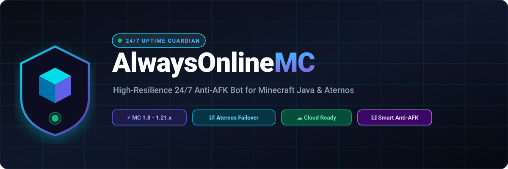

<div align="center">

  

  # 🤖 AlwaysOnlineMC

  **High-resilience 24/7 anti-AFK guardian designed for Minecraft Java Edition and Aternos servers.**

  [-22c55e?style=flat-square&logo=minecraft&logoColor=white)](https://minecraft.net/)
  [](https://nodejs.org/)
  [](https://aternos.org/)
  [](LICENSE)

  <p align="center">
    <a href="#quick-start">⚡ Quick Start</a> •
    <a href="#how-it-works">💡 How It Works</a> •
    <a href="#cloud-deployment">☁️ Cloud Deploy</a> •
    <a href="#features">✨ Features</a> •
    <a href="#configuration">⚙️ Config</a> •
    <a href="#troubleshooting">🛠️ FAQ</a>
  </p>

</div>

---

## <a id="how-it-works"></a>💡 How It Works

Free hosting providers like **Aternos** terminate server instances when player count drops to zero for extended periods (typically 5 to 10 minutes). 

**AlwaysOnlineMC** ensures uninterrupted uptime through three core systems:

1. **Persistent Socket Session**: Maintains an active TCP player connection with the server, keeping the online player count at `1+` to prevent automated shutdown triggers.
2. **Dual-Route DNS Failover**: Dynamically alternates between your primary server domain (`yourserver.aternos.me`) and Aternos dynamic endpoints (`*.aternos.host`), automatically recovering across server restarts and IP reassignments.
3. **Natural Motion Engine**: Generates smooth mouse-interpolated head rotations, micro-jitters, dynamic wandering, and periodic block placements to avoid heuristic AFK detection plugins.

---

## <a id="features"></a>✨ Features

- **Multi-Version Protocol Support**: Native support for **Minecraft 1.21.4 (Protocol 769)** with automated protocol negotiation back to 1.8.x.
- **Smart Reconnection & Backoff**: Exponential backoff with random jitter prevents connection throttling during server reboots.
- **Humanized Anti-AFK**:
  - Ease-out quadratic curves for head rotations (`smoothLook`).
  - Subtle mouse-drift simulation (±2°–4° micro-jitters).
  - Natural player interaction: faces approaching players and executes responsive greetings.
  - Safe two-way wandering with ground verification to prevent falling into hazards.
- **Universal Block Placement**: Automatically detects and places inventory items on adjacent surfaces in open terrain or enclosed bedrock rooms.
- **Interactive Chat Engine**:
  - Contextual player join and leave messages.
  - Direct mention listener (`@botname`).
  - Optional regional slang (Bangla gaming banter).
  - Cooldown limiter to prevent server mute or anti-spam kicks.
- **Resource Pack Auto-Accept**: Seamlessly handles server-enforced resource pack handshakes.
- **Automated Respawn & Dismount**: Automatically triggers respawn sequences and dismounts vehicles upon entity death.
- **Minimal Resource Footprint**: Configured with `VIEW_DISTANCE=tiny`, consuming under **50MB RAM** and near **0% CPU** at idle.

---

## <a id="quick-start"></a>⚡ Quick Start

### Prerequisites
- **Node.js**: Version 18.0.0 or higher ([nodejs.org](https://nodejs.org/))
- **Git**: ([git-scm.com](https://git-scm.com/))

### 1. Installation

```bash
git clone https://github.com/OTAKUWeBer/AlwaysOnlineMC.git
cd AlwaysOnlineMC
npm install
```

### 2. Configuration

Create your local `.env` file from the provided template:

```bash
# Windows PowerShell
Copy-Item .env.example .env

# Linux / macOS / Bash
cp .env.example .env
```

Edit `.env` with your server credentials:

```ini
# Server Connection
SERVER_HOST=your-server.aternos.me
SERVER_PORT=25565

# Dynamic Fallback (Optional)
ENABLE_DYNAMIC_FAILOVER=false
FALLBACK_HOST=your-dyn-ip.aternos.host
FALLBACK_PORT=25565

# Bot Profile
BOT_USERNAME=YumeVanguard
AUTH_MODE=offline
MC_VERSION=1.21.4

# Feature Toggles
ENABLE_CHAT=true
ENABLE_BANGLA_SLANG=true
ENABLE_BLOCK_PLACING=true
TIMEZONE=Asia/Dhaka
```

### 3. Launch

**Windows (Auto-Restart Loop):**
Double-click `start.bat` or run:
```powershell
.\start.bat
```

**Linux / macOS (Auto-Restart Loop):**
```bash
chmod +x start.sh
./start.sh
```

**Standard Launch:**
```bash
npm start
# or
node bot.js
```

---

## <a id="cloud-deployment"></a>☁️ 24/7 Cloud Deployment

To keep the bot running without leaving your local computer powered on, deploy to any of the following free cloud environments:

### Option 1: Render.com (Background Worker)

1. Fork or push this repository to your GitHub account.
2. Log in to [Render.com](https://render.com/) and navigate to **New +** → **Background Worker**.
3. Select your repository and configure the service:
   - **Runtime**: `Node`
   - **Build Command**: `npm install`
   - **Start Command**: `node bot.js`
4. Under **Environment Variables**, add the keys from your `.env` file (`SERVER_HOST`, `SERVER_PORT`, `FALLBACK_HOST`, `BOT_USERNAME`).
5. Click **Create Background Worker**.

---

### Option 2: Oracle Cloud Always-Free Compute

Oracle Cloud provides free ARM/AMD compute instances with dedicated public IPs:

1. Provision an **Ubuntu 22.04 / 24.04** compute instance via the [Oracle Cloud Free Tier](https://www.oracle.com/cloud/free/).
2. Connect via SSH and run:
   ```bash
   sudo apt update && sudo apt install -y nodejs npm git
   git clone https://github.com/OTAKUWeBer/AlwaysOnlineMC.git
   cd AlwaysOnlineMC
   npm install
   sudo npm install -g pm2
   cp .env.example .env
   nano .env  # Configure your server details
   pm2 start bot.js --name "alwaysonlinemc"
   pm2 startup
   pm2 save
   ```

---

### Option 3: Container Platforms (Railway / Koyeb / Fly.io)

- **Railway / Koyeb**: Connect your GitHub repository and set the start command to `node bot.js`.
- **Pterodactyl Game Panels**: Upload project files, set entrypoint to `bot.js`, and start the node.

---

## 🎮 Supported Versions

| Release Era | Versions | Protocol Range | Support Level |
| :--- | :--- | :--- | :--- |
| **Tricky Trials** | 1.21 – 1.21.4 | 766 – 769 | Full Support (Native) |
| **Trails & Tales** | 1.20 – 1.20.6 | 762 – 765 | Full Support |
| **The Wild Update** | 1.19 – 1.19.4 | 759 – 761 | Full Support |
| **Caves & Cliffs** | 1.17 – 1.18.2 | 755 – 758 | Full Support |
| **Nether Update** | 1.16 – 1.16.5 | 735 – 754 | Full Support |
| **Legacy Releases** | 1.8 – 1.15.2 | 47 – 578 | Full Support |

*Cross-play setups using GeyserMC and Floodgate are fully supported.*

---

## <a id="configuration"></a>⚙️ Configuration Reference

| Variable | Default | Description |
| :--- | :--- | :--- |
| `SERVER_HOST` | `your-server.aternos.me` | Primary hostname or domain |
| `SERVER_PORT` | `25565` | Primary server port |
| `ENABLE_DYNAMIC_FAILOVER` | `false` | Enable fallback route cycling (`true`/`false`) |
| `FALLBACK_HOST` | `your-dyn-ip.aternos.host` | Dynamic IP endpoint for Aternos failover |
| `FALLBACK_PORT` | `25565` | Fallback server port |
| `BOT_USERNAME` | `YumeVanguard` | In-game player name |
| `AUTH_MODE` | `offline` | Authentication type: `offline` (cracked) or `microsoft` |
| `MC_VERSION` | `1.21.4` | Minecraft version or `auto` for negotiation |
| `ENABLE_CHAT` | `true` | Master switch for in-game chat events |
| `ENABLE_BANGLA_SLANG` | `true` | Enables regional gaming phrases in chat pool |
| `ENABLE_BLOCK_PLACING` | `true` | Enables active block placement routines |
| `TIMEZONE` | `Asia/Dhaka` | Timezone identifier for log timestamps |

---

## 🏰 In-Game Setup (Command Blocks)

For survival servers, run the following administrative commands to ensure the bot remains protected:

```bash
# Prevent hunger depletion
/effect give YumeVanguard minecraft:saturation infinite 255 true

# Provide invulnerability against hostile mobs
/effect give YumeVanguard minecraft:resistance infinite 255 true

# Enclose in protective bedrock box (run once at bot position)
/execute as YumeVanguard at @s run fill ~-1 ~-1 ~-1 ~1 ~2 ~1 bedrock

# Supply blocks for placement routines
/give YumeVanguard purple_concrete 64
```

---

## <a id="troubleshooting"></a>🛠️ Troubleshooting

### Connection Reset (`ECONNRESET`)
* **Cause**: Server is actively restarting or booting on Aternos.
* **Resolution**: No manual intervention required. The failover loop will automatically rotate endpoints and connect when the socket is ready.

### Authentication Failure (`Invalid session`)
* **Cause**: Server enforces online mode authentication (`online-mode=true`).
* **Resolution**: Set `online-mode=false` in `server.properties` if using `AUTH_MODE=offline`, or switch `AUTH_MODE=microsoft`.

### Anti-Cheat Movement Disconnects
* **Cause**: Server anti-cheat flagged jumping or movement velocity.
* **Resolution**: Ensure `allow-flight=true` in `server.properties` or whitelist the bot username in your anti-cheat configuration.

---

## 📄 License

This project is licensed under the [MIT License](LICENSE).

<div align="center">
  <sub>Maintained by <a href="https://github.com/OTAKUWeBer">Weber</a> for <a href="https://yumezone.com">YumeZone</a>.</sub>
</div>